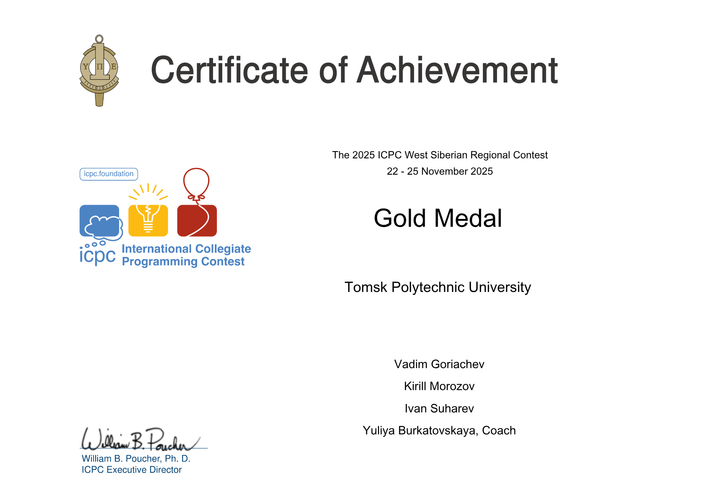

<h2>About me</h2>

I'm a second-year full-time student interested in competitive programming and anything related to high-load systems. I'm currently involved in the development of our university project, "Geo-Assistant," where I'm designing the backend portion of our application, implementing microservices in Go, administrating the GitHub organization and it's repositories, organizing the CI/CD, deploying applications using Kubernetes. I'm also interested in database design and want to build my own distributed key-value database. Also becoming increasingly interested in artificial intelligence, so I've started taking free courses from MIT.

<h3 align="center">Main programming languages</h3>

<h3 align="center">Tools that I am using for programming</h3>

<h3 align="center">Backend equipment</h3>

  

<h3>Competitive programming: Jewish Baikal Autonomy Terrytory ♿</h3>

  

  
  
  

